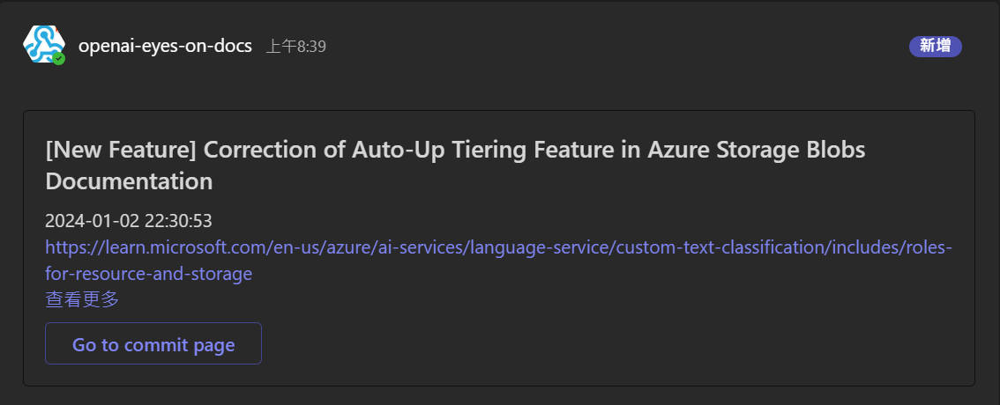
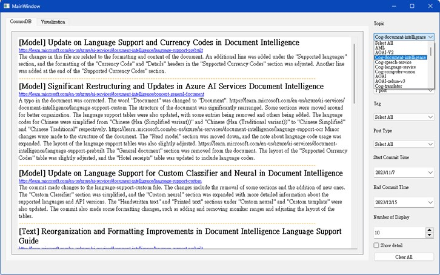
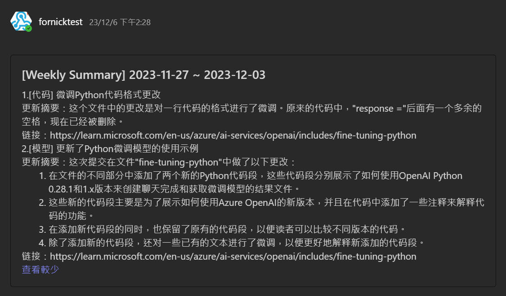
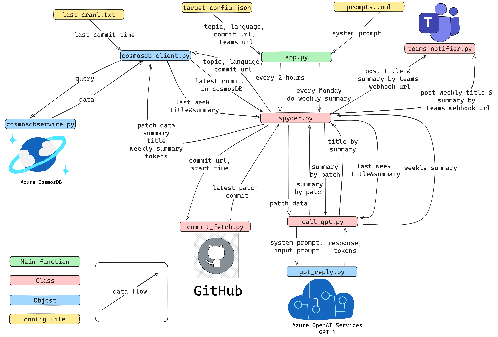
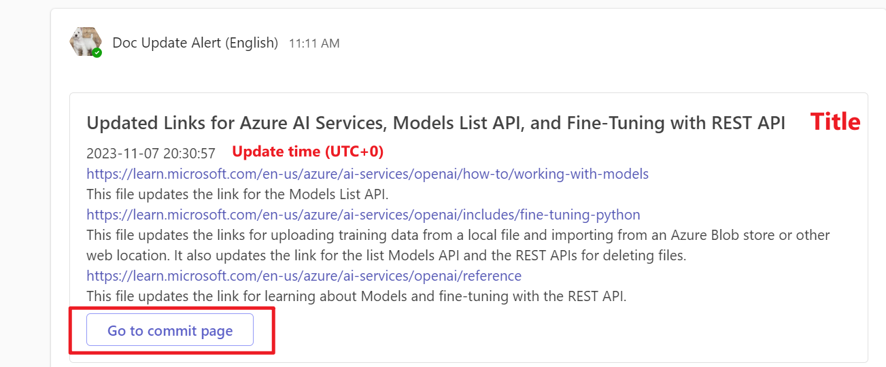
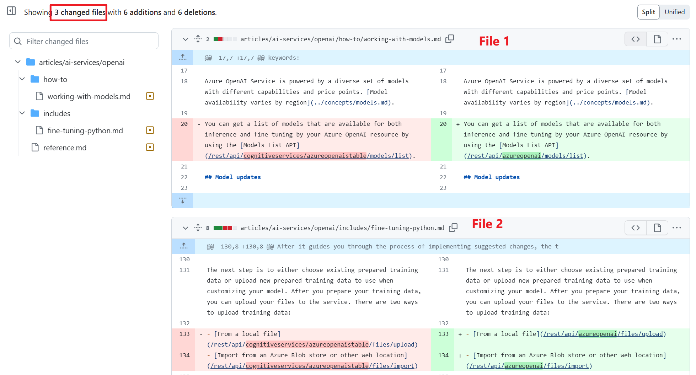
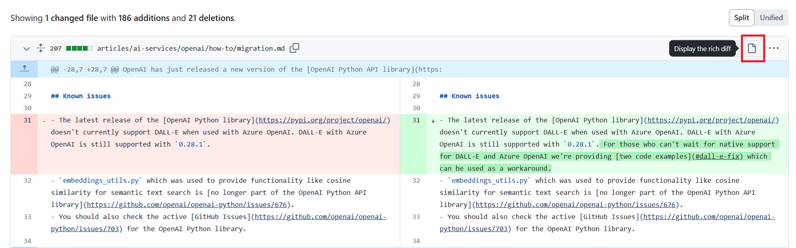
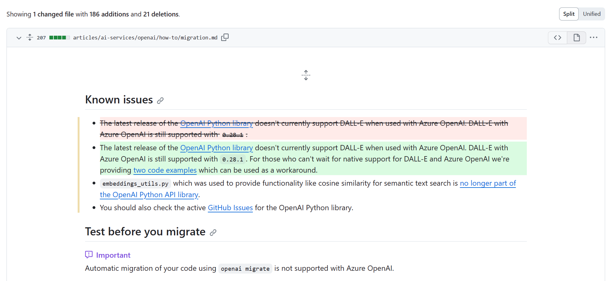
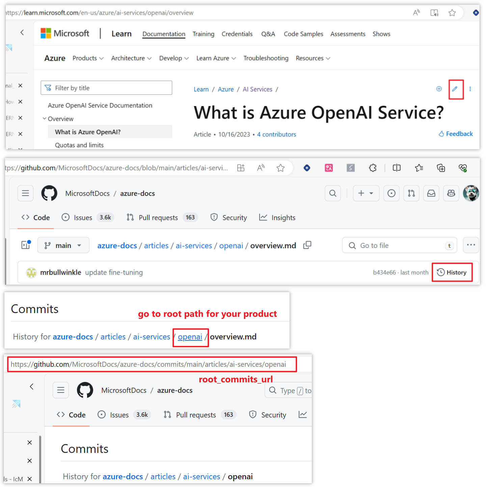

# Document Update Notification Bot

## Overview

The Document Update Notification Bot is an innovative system crafted to keep users proactively informed about the latest updates to Microsoft Learn documents. This tool is essential for support engineers and any users requiring the most updated documentation, enabling them to stay abreast of changes quickly and efficiently.

## Key Features

### Automated Notifications

- **Instant Alerts:** Users receive alerts immediately when the Microsoft Learn documents are updated or changed.
- **Smart Summaries:** The updates are summarized by GPT-4, which also provides well-crafted titles to encapsulate the gist of the changes.

### Importance Assessment

- **Targeted Broadcasts:** The bot evaluates the importance of each update, broadcasting crucial changes directly to a Microsoft Teams channel to ensure significant updates are noticed promptly.

### Data Organization and Analysis

- **Real-Time Sorting:** Through PyQt5, the bot features a sophisticated database query system that organizes the data dynamically as it comes in.
- **In-Depth Data Examination:** The same interface stores updates and offers extensive data analysis capabilities, allowing for efficient parsing and reviewing of information.

### Data Storage

- **Azure Cosmos DB Integration:** Lesser priority updates are systematically filed in Azure Cosmos DB to enable quick and orderly information retrieval and management.

### Weekly Summaries

- **Detailed Recap:** The bot distributes a well-organized summary every Monday, detailing the documentation modifications made in the past week, ranked by importance. This is particularly beneficial for users who need a consolidated update at a glance.

## Technology Stack

- **Python Development Environment:** Spyder alongside PyQt5 was utilized for development, harnessing Python's extensive ecosystem and the PyQt framework to build the user-friendly query system.
- **AI and Cloud Integration:** Services provided by Azure OpenAI, supported by a robust Azure DevOps setup, ensure smooth operations of the bot, streamlined through the CI/CD pipeline.
- **Facilitated Collaboration:** Microsoft Teams integration aids the bot in delivering pertinent information directly within a collaborative workspace.

## Conclusion

The Document Update Notification Bot melds AI, cloud computing, and graphical user interface technologies to fundamentally transform notification management for document updates. It significantly reduces the time support engineers and other professionals spend tracking document revisions, thereby enhancing overall productivity.
   

# System Architecture Introduction

## Overview
This document provides an overview of the system architecture for an automation process designed to fetch, summarize, and notify updates from GitHub commits and data stored in Azure Cosmos DB.

## Components Description

### Configuration Files
- `target_config.json`: Contains configuration data such as topics, language preferences, commit URLs, and Teams webhook URLs.
- `prompts.toml`: Holds system prompts for automated interactions.

### Scripts and Programs

#### Main Application
- `app.py`: The main script that orchestrates the whole process. It initiates the crawl every 2 hours and triggers the weekly summary every Monday.

#### Database Client
- `cosmosdb_client.py`: Interfaces with Azure Cosmos DB to perform queries and retrieve data.
- `cosmosdbservice.py`: A service layer to interact with Cosmos DB for CRUD operations.

#### GitHub Interaction
- `commit_fetch.py`: Fetches the latest commit data from GitHub repositories.

#### Data Processing
- `spyder.py`: Aggregates data, including titles and summaries, and prepares weekly summaries.

#### AI Integration
- `call_gpt.py`: Calls Azure OpenAI services using GPT-4 to generate responses and summaries.
- `gpt_reply.py`: Processes the GPT-4 generated outputs and formats them for further use in the system.

#### Notification
- `teams_notifier.py`: Sends notifications with titles and summaries to Microsoft Teams using webhook URLs.

### External Services

- **GitHub**: Source of commit data used in the system.
- **Azure Cosmos DB**: Database for storing and managing query data.
- **Azure OpenAI Services (GPT-4)**: Provides AI capabilities for text generation and processing.

## Data Flow
1. `app.py` initiates the process, calling `spyder.py` to fetch data every 2 hours and generate the weekly summary.
2. `spyder.py` gathers the latest commits from GitHub through `commit_fetch.py` and queries Azure Cosmos DB through `cosmosdb_client.py`.
3. For AI-powered summarization, `spyder.py` invokes `call_gpt.py`, which uses `gpt_reply.py` to handle the AI responses.
4. Summaries and data are forwarded to `teams_notifier.py` to post updates and summaries to Microsoft Teams.

## Legend
- **Main function**: Highlighted in green, represents primary entry-points and orchestrators of processes.
- **Class**: Denoted in pink, represents object-oriented components categorized logically for the system.
- **Object**: Shown in blue, indicates specific instances or records such as data from the database.
- **config file**: Marked in yellow, represents configuration files that are used to store static data.

Please refer to this document to understand the workflow and interaction between the various components of our system.
  

# User Interface

In the Teams Channel, users can observe the following notifications:

- Titles are formulated by GPT-4.
- The updates' UTC time is displayed in the second line.
- The body presents a GPT-4 generated summary of updates made to various documents. For instance, the example shows updates to three documents.
- Links are provided to view the official documentation.
- The “Go to commit page” button redirects users to the GitHub commit page.

## Commit Page

[Commit Example on GitHub](https://github.com/MicrosoftDocs/azure-docs/commit/4189b431df9d28d94f54661e223c318335bcb9f2)

The update includes changes to three files, aligned with the GPT-4 summary. The left displays the version before the update, and the right shows the post-update version.

You can view the updated contents more clearly by clicking the Preview button positioned in the top right corner.

## Implementation

Taking the Azure OpenAI documentation updates as an example, each documentation update is logged here: [Azure OpenAI Documentation Commits](https://github.com/MicrosoftDocs/azure-docs/commits/main/articles/ai-services/openai).
- Scrape the content of each commit.
- Submit the content to GPT-4 for summarization and title generation.
- Push the summary generated by GPT-4 to the Teams Channel via the Teams Channel Webhook.
- The program checks for new commits every hour.

## Running Configuration

1. Install the necessary packages: `pip install -r requirements`
2. Follow the example in `.env.example` to create a `.env` file:
   - [Generate a GitHub access token](https://docs.github.com/en/github/authenticating-to-github/creating-a-personal-access-token)
   - [Create Azure OpenAI resource. Please use GPT-4!](https://learn.microsoft.com/en-us/azure/ai-services/openai/how-to/create-resource?pivots=web-portal)
   - [Create a CosmosDB account, database, container, and retrieve the key.](https://learn.microsoft.com/en-us/azure/cosmos-db/nosql/quickstart-portal)
3. Use `last_crawl_time.txt.example` as a guide to create `last_crawl_time.txt`:
   - For the initial setup, the bot will consider changes that occur after the specified timestamp (UTC+0).
   - If not created manually, the bot will generate the file and insert the current time.
   - [Related code.](https://dev.azure.com/GCR-AI-IoT-Team-Operation/_git/DocUpdateNotificationBot?path=/app.py&version=GBmaster)
4. Refer to `target_config.json.example` to create `target_config.json`.

## How to acquire the root_commits_url used in target_config.json?

## How to Create Teams Channel Webhook

[Steps to create an incoming webhook in Microsoft Teams](https://learn.microsoft.com/en-us/microsoftteams/platform/webhooks-and-connectors/how-to/add-incoming-webhook)